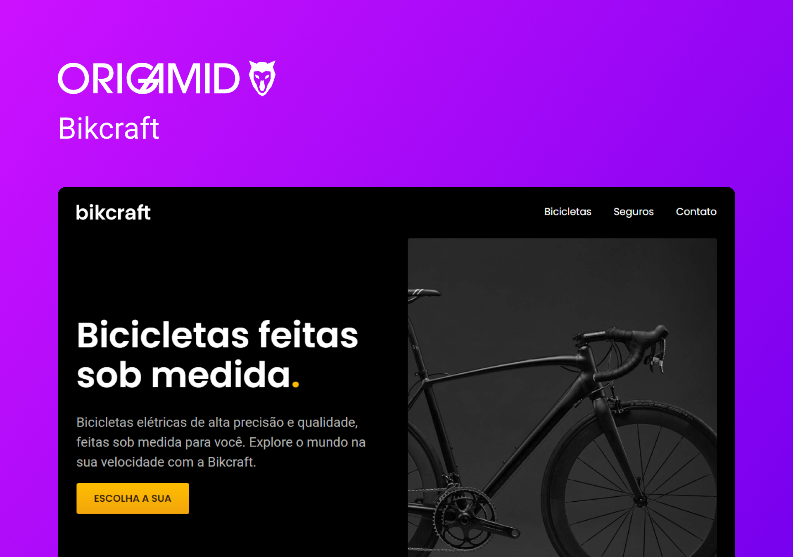

<h1 align="center"> Bikcraft </h1>

  <b>PT-BR:</b> Um projeto simples simulando um blog pessoal com artigos de tecnologia. 

  <b>EN:</b> A simple project simulating a personal blog with technology articles. 

  <a href="#gear-tecnologias">Tecnologias</a>&nbsp;&nbsp;&nbsp;|&nbsp;&nbsp;&nbsp;
  <a href="#writing_hand-aprendizados">Aprendizados</a>&nbsp;&nbsp;&nbsp;|&nbsp;&nbsp;&nbsp;
  <a href="#memo-licença">Licença</a>

  

  

## :gear: Tecnologias

- HTML
- CSS
- JavaScript

## :writing_hand: Aprendizados

## :memo: Licença

Esse projeto está sob a licença MIT.
