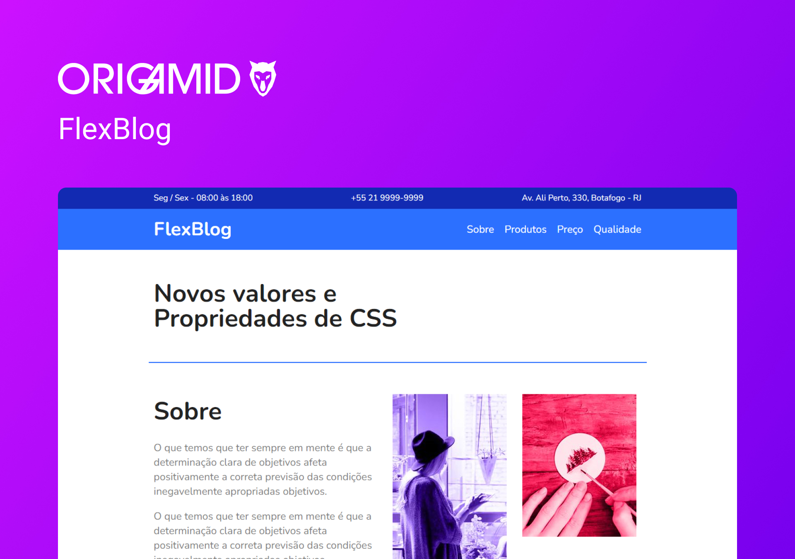

<h1 align="center"> FlexBlog </h1>

  <b>PT-BR:</b> Página final desenvolvida para aplicação dos fundamentos de Flexbox. Desenvolvido durante o curso de CSS Flexbox na Origamid. 

  <b>EN:</b> Final page developed for application of Flexbox fundamentals. Developed during the CSS Flexbox course at Origamid. 

  <a href="#gear-tecnologias">Tecnologias</a>&nbsp;&nbsp;&nbsp;|&nbsp;&nbsp;&nbsp;
  <a href="#writing_hand-aprendizados">Aprendizados</a>&nbsp;&nbsp;&nbsp;|&nbsp;&nbsp;&nbsp;
  <a href="#memo-licença">Licença</a>

  

  

## :gear: Tecnologias

- HTML
- CSS Flexbox

## :writing_hand: Aprendizados

Neste curso aprendi todas as principais técnicas e conceitos de como utilizar CSS Flexbox em um projeto completo e como fica fácil organizar o conteúdo em tela. A minha principal dificuldade em Flexbox durante o curso foi sobre a propriedade `flex-basis`.

## :memo: Licença

Esse projeto está sob a licença MIT.
