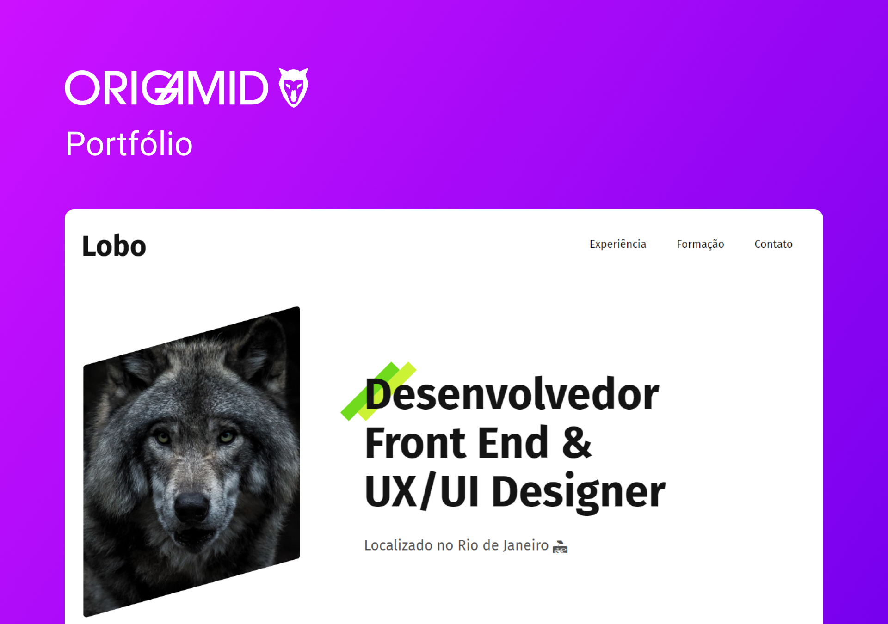

<h1 align="center"> Projeto Portfólio </h1>

  <b>PT-BR:</b> Projeto simulando um portfólio pessoal contendo as habilidades necessárias para o mercado de trabalho. 

  <b>EN:</b> Project simulating a personal portfolio containing the necessary skills for the job market. 

  <a href="#gear-tecnologias">Tecnologias</a>&nbsp;&nbsp;&nbsp;|&nbsp;&nbsp;&nbsp;
  <a href="#writing_hand-aprendizados">Aprendizados</a>&nbsp;&nbsp;&nbsp;|&nbsp;&nbsp;&nbsp;
  <a href="#memo-licença">Licença</a>

  

  

## :gear: Tecnologias

- HTML
- CSS

## :writing_hand: Aprendizados

Este foi o primeiro projeto desenvolvido no curso Origamid e foi extremamente importante para fixar conceitos, técnicas, entender as tags HTML e seus aninhamentos. Aprendi a separar o CSS em arquivos separados e com isso percebi que posso fragmentar melhor as etapas de um projeto.

## :memo: Licença

Esse projeto está sob a licença MIT.
