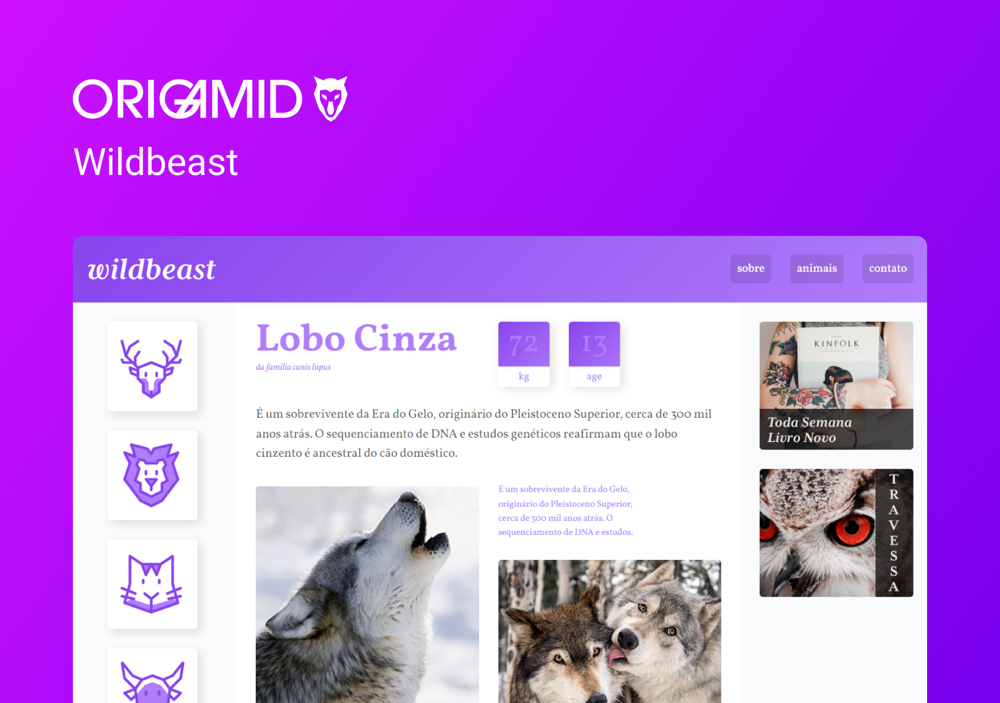

<h1 align="center"> Wildbeast </h1>

  <b>PT-BR:</b> Site de curiosidades do mundo animal para aprendizado e fixação de CSS Grid Layout. 

  <b>EN:</b> Animal world trivia website for learning and fixing CSS Grid Layout. 

  <a href="#gear-tecnologias">Tecnologias</a>&nbsp;&nbsp;&nbsp;|&nbsp;&nbsp;&nbsp;
  <a href="#writing_hand-aprendizados">Aprendizados</a>&nbsp;&nbsp;&nbsp;|&nbsp;&nbsp;&nbsp;
  <a href="#memo-licença">Licença</a>

  

  

## :gear: Tecnologias

- HTML
- CSS Grid Layout

## :writing_hand: Aprendizados

Na minha opinião o curso de CSS Grid Layout por incrível que pareça foi mais fácil do que o CSS Flexbox. Entender e imaginar a página como linhas e colunas facilita muito na criação de um site e ao usar Grid Layout as coisas ficam mais claras ainda. No geral não tive dificuldades com as propriedades e sim com alguns cálculos que são feitos.

## :memo: Licença

Esse projeto está sob a licença MIT.
